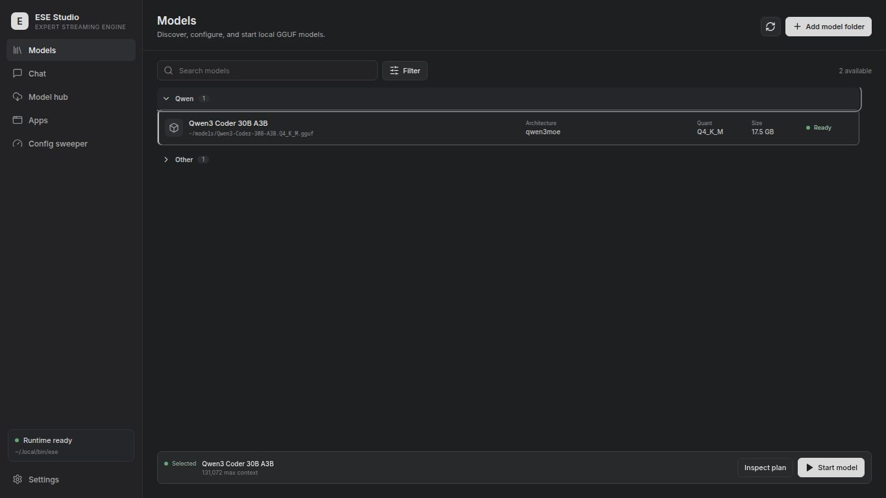
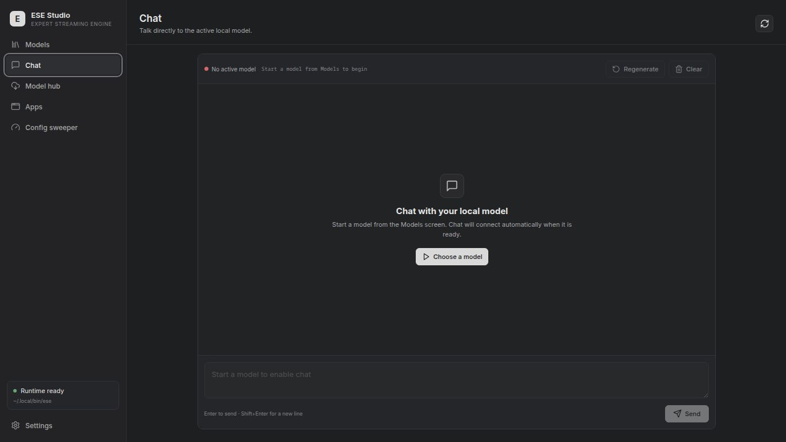
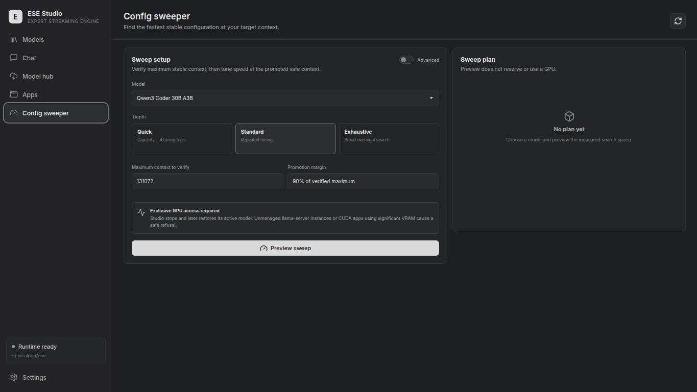
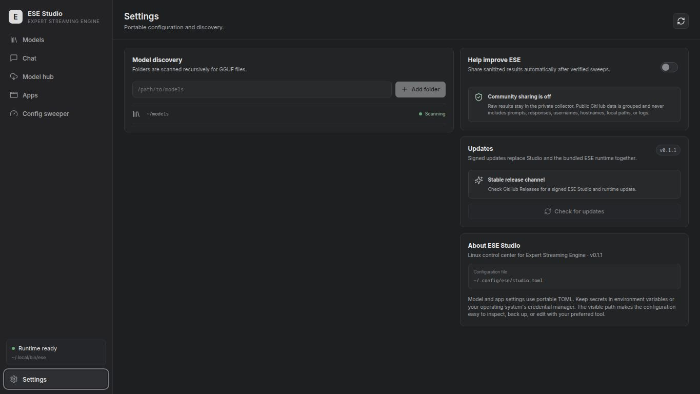

# Expert Streaming Engine

[](https://github.com/xero00000/expert-streaming-engine/actions/workflows/ese-ci.yml)
[](https://github.com/xero00000/expert-streaming-engine/releases/latest)
[](LICENSE)

Run sparse Mixture-of-Experts GGUF models when the full model does not fit in
VRAM—and, with deferred experts, when it cannot safely remain resident in RAM.

Expert Streaming Engine (ESE) is a Linux-focused `ik_llama.cpp`/`llama.cpp`
fork. It combines a transparent `ese` launcher with a native global resource
controller and a bounded `NVMe → RAM → VRAM` expert hierarchy. The result is a
normal `llama-server` and OpenAI-compatible API with explicit memory limits,
observable decisions, and no hidden backend or precision fallback.

## Install ESE Studio + ESE

The v0.2.0 desktop installers are unified: one installation provides ESE
Studio, the `ese` launcher, and a matching native `llama-server` runtime. The
Windows package includes CUDA acceleration for NVIDIA GPUs and retains CPU
fallback. Linux packages carry a portable CPU baseline. A source install
detects an NVIDIA toolchain and builds CUDA automatically, falling back to CPU
when CUDA is unavailable.

Download the package and checksum file from the
[latest release](https://github.com/xero00000/expert-streaming-engine/releases/latest),
then verify and install it.

### Linux

The AppImage is recommended when you want signed in-app updates:

```bash
sha256sum --check --ignore-missing SHA256SUMS
chmod +x ese-studio_0.2.0_amd64.AppImage
./ese-studio_0.2.0_amd64.AppImage
```

Native packages integrate with the system package manager and are updated by
installing the next package release:

```bash
sudo apt install ./ese-studio_0.2.0_amd64.deb       # Debian / Ubuntu
sudo dnf install ./ese-studio-0.2.0-1.x86_64.rpm   # Fedora / Nobara
```

For a user-local accelerated build from source:

```bash
git clone https://github.com/xero00000/expert-streaming-engine.git
cd expert-streaming-engine
./studio/scripts/install-local.sh
ese doctor
```

The installer lists missing build dependencies and asks before installing
them. It installs Studio under `~/.local/share/ese-studio`, and installs both
`ese-studio` and `ese` commands under `~/.local/bin`.

### Windows

Download the NSIS `ese-studio_0.2.0_x64-setup.exe` (recommended) or MSI,
compare its SHA-256 value with `SHA256SUMS-windows.txt`, and run it. Studio, a
standalone `ese.exe`, and the native server are installed together; Python is
not required at runtime. The NSIS build supports signed in-app updates from
**Settings → Updates**.

To build from source, open PowerShell in the repository:

```powershell
cd studio
.\install.ps1 -Check
.\install.ps1
```

The preflight can offer to install Python, CMake, Node.js, Rust, MSVC Build
Tools, and WebView2 through `winget`; it never installs them without consent.

## Command-line quick start

Requirements: Python 3.10+, CMake, a C++ compiler, and optionally an NVIDIA
CUDA toolchain. Linux is supported directly; Windows uses the MSVC Build Tools
and PowerShell.

```bash
git clone https://github.com/xero00000/expert-streaming-engine.git
cd expert-streaming-engine

./ese doctor
./ese build                    # auto-detect CUDA; use --backend cpu to force CPU
./ese plan /models/model.gguf  # inspect the complete command without running it
./ese serve /models/model.gguf
```

On Windows, run the same workflow from PowerShell with the included launcher:

```powershell
.\ese.cmd doctor
.\ese.cmd build --backend cpu
.\ese.cmd plan C:\Models\model.gguf
.\ese.cmd serve C:\Models\model.gguf
```

Use `--backend cuda` when the Windows CUDA toolkit and a supported NVIDIA GPU
are available.

The server listens on `http://127.0.0.1:8080` by default. Check it with:

```bash
curl http://127.0.0.1:8080/health
```

Split GGUFs are supported: pass any correctly named shard and ESE validates the
complete set before launch.

## ESE Studio

`studio/` contains the ESE Studio desktop GUI for model discovery, ESE
planning/serving, configurable CLI apps in embedded terminal tabs, and
verified configuration sweeps. It is deliberately a control center rather
than a second inference backend: every model launch still goes through ESE's
inspectable planner and `llama-server` command. Its installer checks required
commands and system libraries and asks before installing missing packages.

Studio and ESE are versioned as one unit. From v0.1.1 onward, the packaged
launcher/runtime is the one Studio uses; an unrelated older `ese` on `PATH`
does not silently take precedence. Signed updates are checked manually from
Settings, show byte progress, verify before installation, and leave the
current install intact if a download or verification fails.



| Local chat | Configuration sweeper |
| --- | --- |
|  |  |



### GUI tour

The interface uses a restrained, keyboard-friendly dark layout with six main
workspaces:

| Screen | What it does |
| --- | --- |
| **Models** | Groups discovered GGUFs by model family, keeps each family collapsed until opened, and separates missing profiles into a collapsed unavailable section. Select a model to review its size, architecture, quantization, context, and saved launch profile. |
| **Chat** | Provides a familiar streaming conversation view for the active local model, with stop, regenerate, clear, keyboard-send controls, and local conversation persistence. Prompts and responses stay between Studio and the local ESE endpoint. |
| **Model hub** | Searches Hugging Face GGUF repositories, groups quantizations and split shards, recommends a hardware-appropriate download, and shows bytes transferred, speed, ETA, pause/cancel state, and resumable progress. |
| **Apps** | Detects local agent CLIs such as Codex, Claude Code, OpenCode, Hermes, Gemini CLI, and Aider. Profiles remain editable, so advanced users can add any terminal application or custom arguments. |
| **Config sweeper** | Runs measured Quick, Standard, or Exhaustive searches. The default objective finds the maximum safe context first and then the fastest stable KV/batch configuration at that context; advanced mode exposes selectable objectives and the full search controls. |
| **Settings** | Manages model folders, rescans installed applications, controls the optional **Help improve ESE** upload, and shows the portable configuration location. |

Launching a model or CLI app opens it inside Studio's persistent terminal
area. Terminal tabs can be resized, expanded, collapsed, and restored without
losing the running session. When a model is active, endpoint-aware apps receive
its URL, API key, model identity, GGUF metadata, context, KV type, batch, and
ubatch automatically. The GUI keeps previewed settings, live measurements,
saved profiles, and unavailable models visually distinct so an estimate cannot
be mistaken for verified evidence.

Studio automatically discovers supported local agent CLIs from `PATH`, NVM,
`~/.local/bin`, Cargo, Bun, and npm-global installs without replacing customized
profiles. Endpoint-aware apps receive the active model URL, API key, model/GGUF
identity, context, architecture, quantization, KV type, batch, and ubatch in
their terminal environment. Hermes is additionally synchronized to the active
`llamacpp` provider before `hermes chat` starts.

The Model hub searches Hugging Face GGUF repositories, groups recognized
quantizations and shards, and recommends the highest-quality quant that fits a
conservative aggregate VRAM/RAM budget reported by `ese doctor`. Larger models
remain selectable and are clearly marked for hybrid/cache or ESE streaming.
Downloads are revision-pinned, disk-space checked, resumable, cancellable, and
show live transferred bytes, speed, and ETA. Set `HF_TOKEN` (or
`HUGGING_FACE_HUB_TOKEN`) in Studio's environment for gated or private models;
tokens are never written to Studio TOML.

Studio runs real health-checked completion trials, checkpoints every result,
resumes interrupted matching sweeps, restores the previously active model, and
can apply the verified context/KV/batch profile to future launches. Preview and
measured states remain visibly distinct. See the [Studio guide](studio/README.md)
and [architecture](docs/ESE_STUDIO_ARCHITECTURE.md).

During first-run setup, users may optionally enable **Help improve ESE**. The
same switch remains available in Settings and is off by default. Enabled
installations automatically submit sanitized summaries only after verified
sweeps. Raw submissions remain in a private collector; the public
[community benchmark list](COMMUNITY_BENCHMARKS.md) contains grouped results
only and suppresses groups with fewer than three samples.

## Four execution policies

`auto` is recommended. ESE inspects GGUF metadata, all model shards, available
host RAM, and current per-GPU VRAM before choosing a native policy.

| Policy | Use it when | Execution path |
| --- | --- | --- |
| `resident` | The model fits safely in VRAM, or is dense | Normal GPU offload and native fit |
| `hybrid` | You want static CPU/GPU MoE placement | Dense tensors on GPU; experts on CPU; optional GPU MoE tail |
| `cache` | Sparse weights fit RAM but not VRAM | Bounded RAM leases feeding adaptive per-device VRAM caches |
| `stream` | Sparse weights exceed the safe RAM budget | Deferred expert storage feeding the same bounded cache hierarchy |

```bash
./ese serve MODEL.gguf --policy auto
./ese serve MODEL.gguf --policy hybrid --gpu-resident-moe 6
./ese serve MODEL.gguf --policy cache --expert-ram-cache 4GiB
./ese serve MODEL.gguf --policy stream --expert-storage-backend pread
```

Hardware calibration can propose a mixed CPU/GPU expert split, but ESE will not
activate it until the exact model, hardware, and launch configuration beats the
established path with identical deterministic output:

```bash
./ese calibrate --model MODEL.gguf
./ese validate-hybrid MODEL.gguf --policy stream
./ese serve MODEL.gguf --policy stream
```

On strongly heterogeneous systems where valid per-device calibration disagrees,
advanced users can test a specific split with
`./ese validate-hybrid MODEL.gguf --hybrid-candidate N`. The same option on
`plan` or `serve` remains inert until that exact candidate has passing evidence;
it cannot bypass missing or stale calibration.

The validator stores no prompts or generated text. It also requires reconciled
per-layer cache telemetry, mixed CPU/GPU routing, zero forced fallbacks, and CPU
compute/upload timing that remains within conservative bounds of calibration.
Its local evidence is private to the user (`0600`) and becomes stale when the
sampled model contents, hardware topology, or performance-relevant configuration
changes.

Passing evidence also configures a one-way native serving guard. Rolling CPU and
upload windows are checked against the calibrated bounds after transfer events
complete; any contradiction or forced fallback permanently returns subsequent
graphs to the established path. `GET /props` reports the live
`expert_hybrid_guard` state and reason for ESE Studio and operators.

Use `./ese plan MODEL.gguf --json` for machine-readable launcher output. Pass
native `llama-server` options after `--`:

```bash
./ese serve MODEL.gguf -c 131072 -- --jinja --metrics
```

## Native memory controller

The launcher discovers hardware and supplies limits; the native runtime makes
the final allocation decision from real model geometry. Direct native launches
can use the same interface:

```bash
build/bin/llama-server -m MODEL.gguf \
  --memory-policy auto \
  --max-ram 40GiB \
  --reserve-vram 1GiB \
  --min-kv-quality turbo4 \
  --max-context 128K \
  --metrics
```

Before accepting requests, the runtime prints one deterministic JSON plan that
accounts for:

- dense and routed-expert weights;
- bounded expert RAM and per-device VRAM caches;
- KV quality, context, slots, batch, and graph workspace;
- prompt cache and disk-I/O staging;
- MTP/draft and multimodal transient modules;
- a safety reserve on every selected GPU.

The same object is returned by `/props`; `/metrics` reports the selected
context, planned RAM, transient capacity, and per-device headroom. Requested
storage backends and KV quality floors fail closed instead of silently falling
back. Plan transitions use prepare/commit/rollback semantics.

## How data moves

```text
GGUF shards on NVMe
        │
        ▼
checked expert descriptors ──► bounded RAM leases
                                      │
                                      ▼
                              adaptive GPU caches
                                      │
          ┌───────────────────────────┼───────────────────────────┐
          ▼                           ▼                           ▼
      resident                    cache/stream                 transient
    model tensors              routed MoE experts           MTP / mmproj
          └───────────────────────────┬───────────────────────────┘
                                      ▼
                         llama-server / OpenAI API
```

Every cache has a configured capacity. Expert uploads use dedicated CUDA
transfer streams and event-scoped readiness; in-flight leases cannot be
evicted. Multi-GPU placement and reserves are accounted per device.

## Useful commands

```bash
./ese doctor --json
./ese build --backend cuda --clean
./ese plan MODEL.gguf --json
./ese serve MODEL.gguf --dry-run
./ese serve MODEL.gguf --slots 2 -c 131072
./ese serve MODEL.gguf --tensor-split 46,54
./ese serve MODEL.gguf --reserve-vram 2GiB
```

Run `./ese <command> --help` for the complete stable launcher interface. The
full native option reference remains available through
`build/bin/llama-server --help`.

## Validation status

The merged desktop path is covered by Python surface tests, native release
tests, ASAN/UBSAN lifecycle tests, CPU server builds, and model-backed CUDA
validation.

| Area | Current evidence |
| --- | --- |
| Expert hierarchy | mmap/pread parity, forced eviction, sanitizer coverage, and 1/2/3-GPU execution |
| CUDA hardware | RTX 2080 SUPER (`sm_75`), RTX 3060 Ti (`sm_86`), and RTX 3080 (`sm_86`) |
| Global controller | CPU plus real Turing+Ampere three-GPU model load with explicit 1 GiB reserves |
| Hardware-adaptive MoE | Schema-v3 DeepSeek-V4-Flash gate measured 7.54x; model-backed one-way live revocation and `/props` status reporting |
| Kimi Linear | Kimi Linear 48B-A3B MXFP4_MOE loads all 610 tensors; CPU/CUDA KDA parity, deterministic generation, 64K allocation, and bounded top-8 sidecar caching verified |
| Runtime rebalancing | Occupied KV shrink/grow parity, busy-server rejection, injected migration rollback, and post-failure continuation |
| Transient/speculation | CPU, Turing, Ampere, and model-backed image→text module swapping |
| Turbo KV foundation | CPU/CUDA codecs, direct attention paths, lifecycle tests, and quality sweeps |

Ada-or-newer runtime coverage is not claimed: suitable hardware is unavailable
to the solo maintainer. Those architecture-specific gates remain future work;
the runtime must still fail closed rather than inventing a synthetic pass.

The Android/QNN port remains a separate draft until it receives physical-device
build, parity, memory, and thermal evidence. It has no supported remote branch
or packaged runtime on `main`; see the [Android status](docs/android.md).

## Reference performance

On the consolidated v0.1.0 candidate, a Qwen3.6 35B-A3B MoE reached median
throughput of 1,612.46 tok/s for 512-token prompt processing, 1,583.32 tok/s
for 2,048-token prompt processing, and 116.59 tok/s for 128-token generation
across an RTX 3060 Ti, RTX 2080 SUPER, and RTX 3080.

The consolidated v0.1.0 candidate ran a Qwen3.5 27B Q4_K_M dense model across
an RTX 3060 Ti, RTX 2080 SUPER, and RTX 3080. Five-run averages were 660.60
tok/s for 512-token prompt processing, 666.03 tok/s for 2,048-token prompt
processing, and 26.78 tok/s for 128-token generation. A live 65,536-context
server also retained more than its declared 1 GiB reserve on every GPU.

The earlier GPT-OSS 120B F16 expert-streaming record remains available: about
139–141 tok/s warm prefill and 11.5 tok/s short-context decode on the same CPU
class and NVMe storage. These are machine- and configuration-specific
engineering records, not universal performance promises. See
[reference benchmarks](docs/ESE_BENCHMARKS.md) for exact commands, model hash,
hardware, repetition statistics, cold/warm behavior, and ablations.

Kimi Linear 48B-A3B MXFP4_MOE now runs through ESE's hybrid KDA/MLA and
sidecar-cache path. On the reference RTX 3060 Ti + RTX 3080 pair, a 65,536-token
context allocation and deterministic 32-token decode reached 9.29 tok/s with a
`4,22` layer split and 2 GiB expert cache per device. This was a short-prompt
decode test, not evidence of a fully populated 64K prompt; exact results and
the tested command are in the benchmark document.

## Documentation

- [Profiles and tuning](docs/ESE_PROFILES.md)
- [Global resource controller](docs/PHASE4_GLOBAL_RESOURCE_CONTROLLER.md)
- [Architecture and invariants](docs/ESE_ARCHITECTURE.md)
- [ESE Studio architecture](docs/ESE_STUDIO_ARCHITECTURE.md)
- [ESE Studio release checklist](docs/ESE_STUDIO_RELEASE_CHECKLIST.md)
- [Expert-cache validation](docs/PHASE2_EXPERT_CACHE_VALIDATION.md)
- [Turbo KV Phase 1 validation](docs/TURBO_KV_PHASE1_VALIDATION.md)
- [Reference benchmarks](docs/ESE_BENCHMARKS.md)
- [Community benchmarks](COMMUNITY_BENCHMARKS.md)
- [Port roadmap](docs/PORT_ROADMAP.md)
- [Branch policy and historical lineage](docs/BRANCH_POLICY.md)
- [Installation](docs/install.md)
- [Native build guide](docs/build.md)
- [Containers](docker/README.md)
- [Android status](docs/android.md)
- [Native parameter reference](docs/parameters.md)
- [Changelog](CHANGELOG.md)
- [Contributing](CONTRIBUTING.md)

## Scope and lineage

ESE prioritizes bounded memory, reproducibility, and correctness over a single
best benchmark. Experimental formats remain internal until their quality and
lifecycle gates pass. `main` is the only supported remote branch. Platform and
research work uses focused pull-request branches and is documented as available
only while the corresponding remote branch or immutable revision exists.

ESE is MIT licensed. It derives from `ik_llama.cpp`, which derives from
`llama.cpp`; imported work retains its original attribution and license
notices. Windows packages also include NVIDIA CUDA redistributable DLLs under
NVIDIA's terms; see [THIRD_PARTY_NOTICES.txt](THIRD_PARTY_NOTICES.txt) for the
bundled components, exact license provenance, and checksums.
