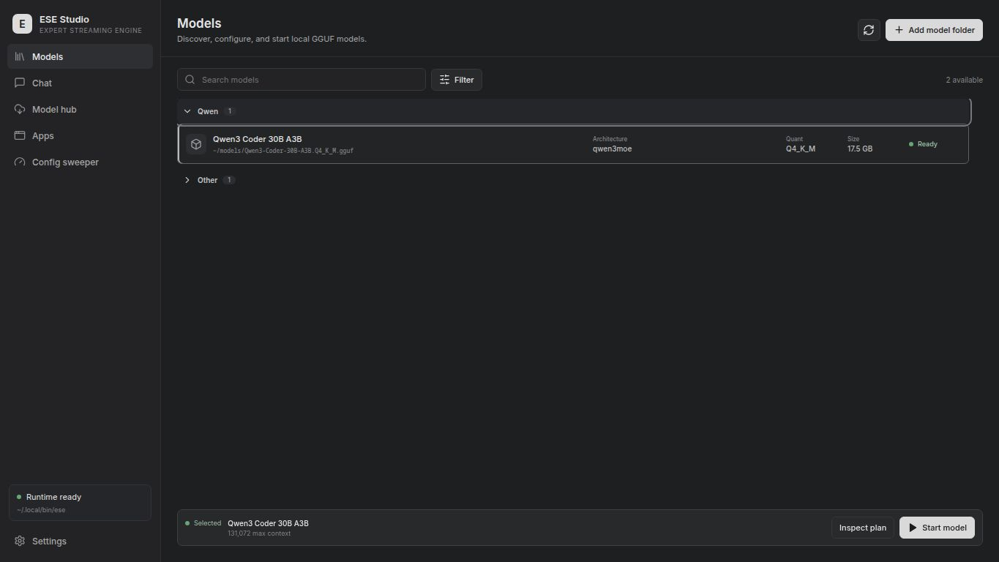
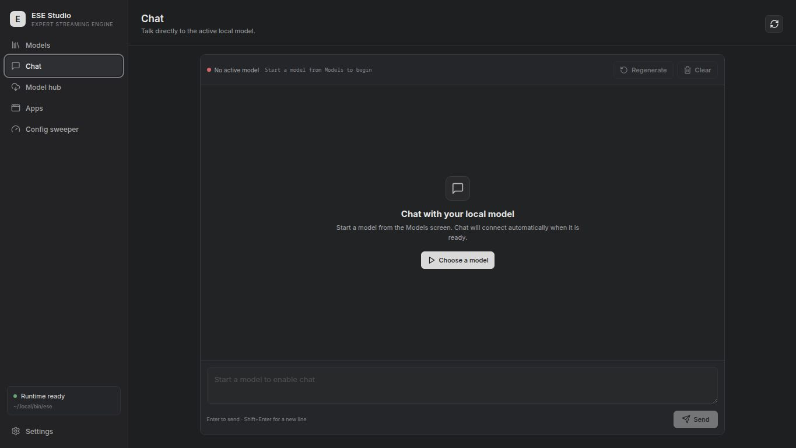
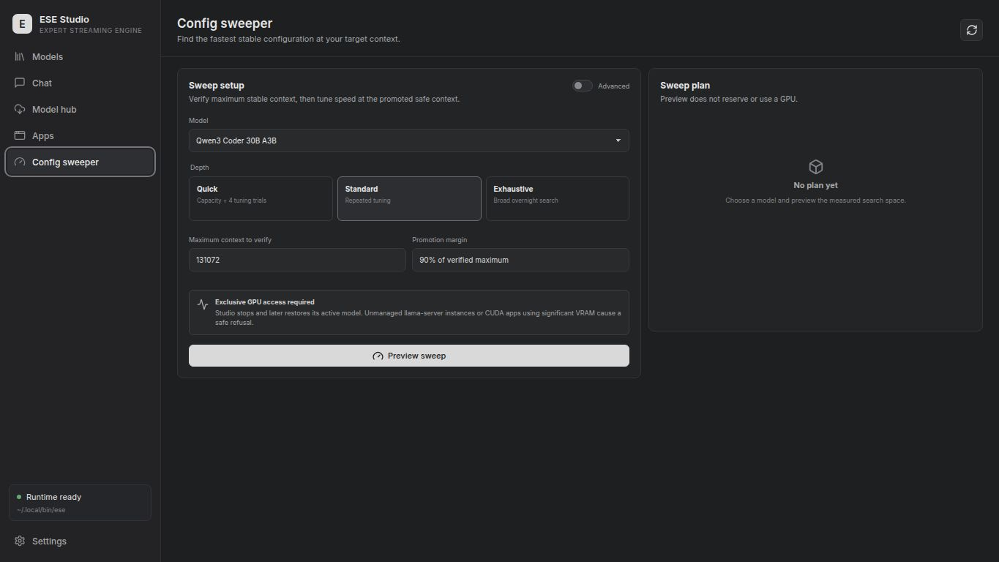

# ESE

## Run bigger AI models than your hardware can hold.

**ESE (Expert Streaming Engine)** is an inference engine for oversized Mixture-of-Experts models.

It turns your **NVMe SSD, system RAM, and GPU VRAM into one managed memory hierarchy**, allowing sparse MoE models to run even when the complete model cannot fit in VRAM—or safely remain resident in RAM.

**Local. Open source. Multi-GPU. Built for models that don't fit.**

[](https://github.com/xero00000/expert-streaming-engine/actions/workflows/ese-ci.yml)
[](https://github.com/xero00000/expert-streaming-engine/releases/latest)
[](LICENSE)

---

## The idea

Large MoE models contain thousands of specialized **experts**, but each token only needs a small subset of them.

You don't necessarily need the entire model sitting in VRAM at once.

ESE manages where model data lives:

```text
                     ┌──────────────────────┐
                     │      MoE MODEL       │
                     │                      │
                     │   thousands of       │
                     │      experts         │
                     └──────────┬───────────┘
                                │
                         expert routing
                                │
              ┌─────────────────┼─────────────────┐
              │                 │                 │
              ▼                 ▼                 ▼
           NVMe SSD          System RAM        GPU VRAM
        cold / deferred      bounded cache     hot experts
              │                 │                 │
              └─────────────────┴─────────────────┘
                                │
                                ▼
                           computation
```

Instead of requiring:

> **Model size ≤ VRAM**

ESE is designed around:

> **Model size can exceed VRAM—and potentially RAM too.**

The runtime decides what can remain resident, what should be cached, and what must be streamed.

---

# Why ESE?

### Your GPU doesn't have to hold the whole model.

ESE supports four execution strategies:

| Policy | What it does |
|---|---|
| **`resident`** | Normal GPU-resident inference when the model fits |
| **`hybrid`** | Static CPU/GPU expert placement |
| **`cache`** | Bounded RAM cache feeding adaptive GPU expert caches |
| **`stream`** | Deferred experts streamed from storage through bounded caches |

`auto` chooses the appropriate policy from model metadata and available hardware.

```bash
./ese serve MODEL.gguf --policy auto
```

---

## What makes ESE different?

### NVMe → RAM → VRAM expert streaming

Experts can remain on storage until they are needed rather than requiring the entire sparse model to be resident.

### Bounded memory

ESE explicitly accounts for:

- GPU VRAM
- system RAM
- expert caches
- KV cache
- graph/workspace memory
- prompt caching
- disk staging
- transient modules
- safety reserves

The goal is **predictable resource usage**, not “hope the OS doesn't OOM.”

### Multi-GPU

ESE can plan across heterogeneous GPUs and account for each device independently.

For example:

```text
RTX 3080       10 GB
RTX 3060 Ti     8 GB
RTX 2080 SUPER  8 GB
       │
       ▼
   ESE planner
       │
       ▼
 coordinated model execution
```

### No silent fallback

When a requested storage backend, KV quality, or execution configuration cannot be safely satisfied, ESE fails closed rather than silently switching to something else.

### Observable decisions

ESE exposes its resource plan and runtime state through:

```text
/props
/metrics
```

You can inspect what the engine believes it is doing rather than treating inference as a black box.

---

# ESE Studio

ESE includes **ESE Studio**, a desktop control center for local inference.



It provides:

| Workspace | Purpose |
|---|---|
| **Models** | Discover and organize local GGUF models |
| **Chat** | Local streaming conversations |
| **Model Hub** | Search and download GGUF models from Hugging Face |
| **Apps** | Launch local coding agents and terminal applications |
| **Config Sweeper** | Find stable context/KV/batch configurations |
| **Settings** | Hardware, model paths, updates, and configuration |

Studio is not a separate inference engine.

**Every model launch goes through ESE's planner and native runtime.**





---

# Get started

## Install

Download the latest release:

**[Latest ESE release](https://github.com/xero00000/expert-streaming-engine/releases/latest)**

The unified desktop package includes:

- ESE Studio
- `ese`
- native `llama-server`
- matching runtime components

### Linux

The AppImage is the easiest option:

```bash
sha256sum --check --ignore-missing SHA256SUMS

chmod +x ese-studio_0.2.0_amd64.AppImage
./ese-studio_0.2.0_amd64.AppImage
```

Or install a native package:

```bash
sudo apt install ./ese-studio_0.2.0_amd64.deb
```

Fedora / Nobara:

```bash
sudo dnf install ./ese-studio-0.2.0-1.x86_64.rpm
```

### Windows

Download the NSIS installer or MSI from the latest release.

The Windows package includes NVIDIA CUDA support and a CPU fallback.

---

# Command-line quick start

For a source installation:

```bash
git clone https://github.com/xero00000/expert-streaming-engine.git
cd expert-streaming-engine

./ese doctor
./ese build
```

Inspect what ESE intends to do:

```bash
./ese plan /models/model.gguf
```

Start a server:

```bash
./ese serve /models/model.gguf
```

The default server listens on:

```text
http://127.0.0.1:8080
```

Check it:

```bash
curl http://127.0.0.1:8080/health
```

ESE provides an OpenAI-compatible local API, so existing applications and coding agents can connect to the same endpoint.

---

# Running models that don't fit

This is where ESE gets interesting.

Suppose your model is larger than the VRAM available on your machine.

Instead of simply failing with:

```text
CUDA out of memory
```

ESE can choose a different execution strategy.

```bash
./ese serve MODEL.gguf --policy auto
```

Or explicitly select one:

```bash
./ese serve MODEL.gguf --policy hybrid
```

```bash
./ese serve MODEL.gguf --policy cache --expert-ram-cache 4GiB
```

```bash
./ese serve MODEL.gguf --policy stream --expert-storage-backend pread
```

The `stream` policy is designed for sparse MoE weights that cannot safely remain resident in RAM.

---

# How the memory hierarchy works

```text
                         GGUF
                          │
                          ▼
                  Expert descriptors
                          │
                          ▼
                    NVMe storage
                          │
                    needed expert
                          │
                          ▼
                    RAM lease
                          │
                          ▼
                 GPU expert cache
                          │
                          ▼
                       compute
                          │
                          ▼
                       output
```

Every cache has an explicit capacity.

In-flight expert leases cannot simply be evicted underneath active work.

GPU transfers use dedicated CUDA transfer streams and event-scoped readiness.

Multi-GPU planning accounts for per-device capacity and reserves.

---

# Automatic planning

ESE's launcher inspects:

- GGUF metadata
- model shards
- routed experts
- host memory
- GPU memory
- context requirements
- KV configuration
- batch configuration
- workspace requirements
- transient modules
- storage requirements

It then produces a deterministic resource plan.

Inspect it without starting inference:

```bash
./ese plan MODEL.gguf --json
```

The same plan is exposed through `/props`.

Runtime measurements are available through `/metrics`.

---

# Hardware-adaptive execution

ESE can calibrate hardware-specific CPU/GPU expert placement rather than assuming that one configuration works everywhere.

```bash
./ese calibrate --model MODEL.gguf
```

Validate a candidate:

```bash
./ese validate-hybrid MODEL.gguf --policy stream
```

Only configurations with passing evidence can become active through the guarded serving path.

This is deliberately conservative.

**ESE would rather reject an unsafe optimization than silently produce incorrect or unstable inference.**

---

# Performance

ESE is designed around two different goals:

1. **Make models that don't fit runnable.**
2. **Make the resulting execution as fast as the available hardware allows.**

Performance depends heavily on model architecture, quantization, context, storage, CPU, GPU topology, and cache configuration.

## Reference results

On the consolidated v0.1.0 candidate:

### Qwen3.6 35B-A3B MoE

Across:

- RTX 3060 Ti
- RTX 2080 SUPER
- RTX 3080

Measured median throughput:

| Workload | Throughput |
|---|---:|
| 512-token prompt | **1,612.46 tok/s** |
| 2,048-token prompt | **1,583.32 tok/s** |
| 128-token generation | **116.59 tok/s** |

### Qwen3.5 27B Q4_K_M

Across the same three GPUs:

| Workload | Throughput |
|---|---:|
| 512-token prompt | **660.60 tok/s** |
| 2,048-token prompt | **666.03 tok/s** |
| 128-token generation | **26.78 tok/s** |

A live 65,536-token-context server also retained more than its declared 1 GiB reserve on every GPU.

### GPT-OSS 120B F16

The earlier expert-streaming record reached approximately:

- **139–141 tok/s** warm prefill
- **11.5 tok/s** short-context decode

on the reference CPU/NVMe system.

### Kimi Linear 48B-A3B MXFP4_MOE

ESE's hybrid KDA/MLA and sidecar-cache path has been validated with:

- 65,536-token allocation
- deterministic 32-token decode
- RTX 3060 Ti + RTX 3080
- `4,22` layer split
- 2 GiB expert cache per device

Measured short-prompt decode:

**9.29 tok/s**

These are engineering measurements on specific hardware and configurations, not universal performance promises.

See the **[reference benchmarks](docs/ESE_BENCHMARKS.md)** for exact commands, model hashes, hardware, repetitions, and ablations.

---

# Validation and correctness

ESE is intentionally conservative about claiming hardware and model support.

Current validation includes:

| Area | Evidence |
|---|---|
| Expert hierarchy | mmap/pread parity, forced eviction, sanitizer coverage, 1/2/3-GPU execution |
| NVIDIA CUDA | RTX 2080 SUPER, RTX 3060 Ti, RTX 3080 |
| Global controller | CPU + three-GPU model loading with explicit reserves |
| Hardware-adaptive MoE | Model-backed calibration and guarded runtime revocation |
| Kimi Linear | KDA/MLA parity, deterministic generation, bounded sidecar caching |
| Runtime rebalancing | KV shrink/grow, migration rollback, continuation after failure |
| Transient modules | CPU, Turing and Ampere module swapping |
| Turbo KV | CPU/CUDA codecs, attention paths, lifecycle tests and quality sweeps |

Unsupported or unverified configurations are **not** presented as validated.

For example, Ada-or-newer architecture-specific runtime coverage is not claimed without suitable physical hardware.

---

# What ESE is built for

ESE is particularly interesting when you have:

### A large MoE model

and

### a surprisingly ordinary computer.

Instead of asking:

> **“Do I have enough VRAM to load this model?”**

ESE lets you ask:

> **“How much of this model actually needs to be resident right now?”**

That distinction becomes increasingly important as sparse models grow.

---

# OpenAI-compatible API

ESE exposes a normal local inference server.

Existing software can connect through:

```text
http://127.0.0.1:8080
```

This makes ESE usable with:

- local applications
- coding agents
- custom clients
- OpenAI-compatible tooling
- local development workflows

The inference engine remains local to your machine.

---

# Useful commands

```bash
# Check hardware and dependencies
./ese doctor

# Machine-readable hardware information
./ese doctor --json

# Build
./ese build --backend cuda

# Inspect a model
./ese plan MODEL.gguf

# Machine-readable plan
./ese plan MODEL.gguf --json

# Dry run
./ese serve MODEL.gguf --dry-run

# Automatic execution policy
./ese serve MODEL.gguf --policy auto

# Hybrid execution
./ese serve MODEL.gguf --policy hybrid

# Bounded expert cache
./ese serve MODEL.gguf --policy cache --expert-ram-cache 4GiB

# NVMe expert streaming
./ese serve MODEL.gguf --policy stream --expert-storage-backend pread

# Hardware calibration
./ese calibrate --model MODEL.gguf
```

Pass native `llama-server` arguments after `--`:

```bash
./ese serve MODEL.gguf -c 131072 -- --jinja --metrics
```

---

# Documentation

- **[Profiles and tuning](docs/ESE_PROFILES.md)**
- **[Architecture](docs/ESE_ARCHITECTURE.md)**
- **[Global resource controller](docs/PHASE4_GLOBAL_RESOURCE_CONTROLLER.md)**
- **[ESE Studio architecture](docs/ESE_STUDIO_ARCHITECTURE.md)**
- **[Expert-cache validation](docs/PHASE2_EXPERT_CACHE_VALIDATION.md)**
- **[Turbo KV validation](docs/TURBO_KV_PHASE1_VALIDATION.md)**
- **[Reference benchmarks](docs/ESE_BENCHMARKS.md)**
- **[Community benchmarks](COMMUNITY_BENCHMARKS.md)**
- **[Installation](docs/install.md)**
- **[Native build guide](docs/build.md)**
- **[Containers](docker/README.md)**
- **[Android status](docs/android.md)**
- **[Native parameter reference](docs/parameters.md)**
- **[Changelog](CHANGELOG.md)**
- **[Contributing](CONTRIBUTING.md)**

---

# Roadmap

ESE is being developed toward a general-purpose runtime for increasingly large sparse models.

Areas of active development include:

- broader model architecture support
- additional GPU architectures
- deeper expert-cache optimization
- improved storage backends
- multi-GPU scheduling
- further KV-cache optimization
- model-specific execution paths
- Android / mobile experimentation

Experimental work is not considered supported until it passes the project's build, correctness, memory, and lifecycle validation requirements.

---

# Project philosophy

ESE prioritizes:

**Correctness over hype.**

**Bounded memory over accidental OOMs.**

**Observable decisions over hidden fallbacks.**

**Reproducible benchmarks over cherry-picked numbers.**

**A maintainable runtime over a disposable demo.**

The goal is simple:

> **Make the biggest practical local models possible on the hardware people actually own.**

---

# License

ESE is released under the **MIT License**.

ESE derives from `ik_llama.cpp`, which derives from `llama.cpp`. Imported work retains its original attribution and license notices.

Windows packages may include NVIDIA CUDA redistributable components under NVIDIA's terms.

See [THIRD_PARTY_NOTICES.txt](THIRD_PARTY_NOTICES.txt) for bundled components, licenses, provenance, and checksums.

---

## Contributing

If you have a model that doesn't fit.

If you have an unusual GPU configuration.

If you can reproduce a performance regression.

If you have an optimization that makes expert streaming faster.

**We want the data.**

Benchmarks, model compatibility reports, bug reports, and hardware results are all useful.

**The more hardware ESE is tested on, the more useful the project becomes.**
